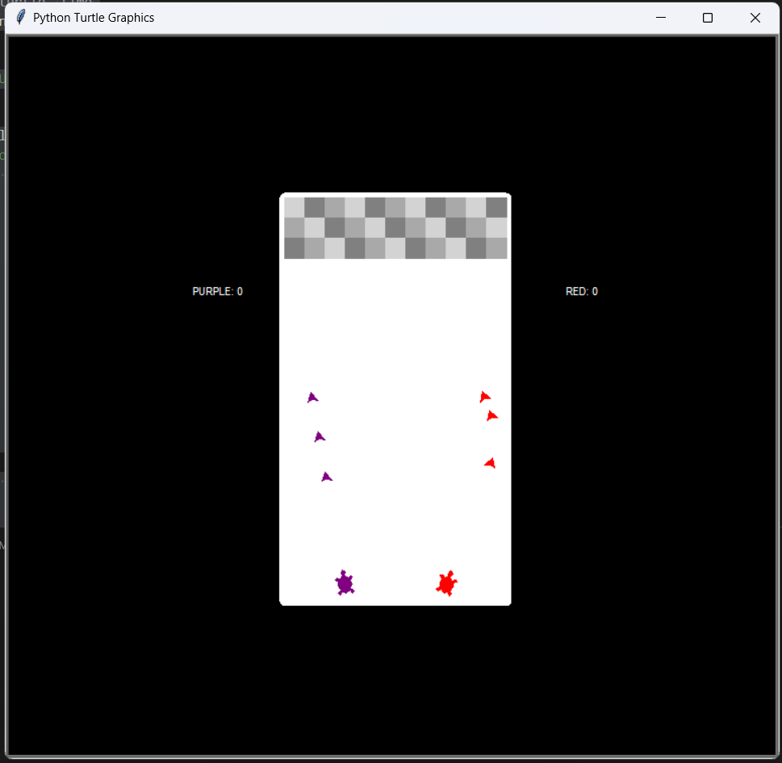

# 9.3-Shooting-Gallery

In this lab, you will create a game using the Turtle graphics module. The game will involve blocks, players, bullets, and score updates.

**Game Description:**

Create a game where two players control "turtles" at the bottom of the screen and shoot "bullets" upwards to destroy "blocks" at the top.

* **Playing Area:** The game area is a rectangle with dimensions 220 x 400 pixels.
* **Blocks:** Three rows of blocks are positioned at the top of the game area.
* **Players:** Two players are positioned at the bottom, each controlling a "turtle" that can move left and right and fire bullets.
* **Bullets:** Each player can fire up to five bullets at a time. Bullets move upwards and are removed when they hit a block or reach the top of the screen.
* **Block Hits:** Blocks change color when hit: their initial color, then orange, then red. After three hits, a block is destroyed.
* **Scoring:** Each player earns a point for destroying a block. Scores are displayed on the screen.

**Implementation Requirements:**

1.  **Object-Oriented Design:**
    * Create the following classes, each inheriting from the `turtle.Turtle` class:
        * `Block`: Represents a block in the game.
        * `Player`: Represents a player and their "turtle."
        * `Bullet`: Represents a bullet fired by a player.
        * `Score`: Represents the score display.

2.  **Class Implementations:**

    * **`Block` Class:**
        * Attributes: color, position, hit count, hit colors (initial, orange, red).
        * Methods:
        *    `delete()` (removes the block)
        *    `strike()` (handles a bullet hit, updates color, and increments hit count).

    * **`Player` Class:**
        * Attributes: color, position, score, controls (keys for movement and firing), list of active bullets.
        * Methods: `turn_right()`, `turn_left()` (handles player movement), `fire()` (creates and fires a bullet, ensuring the bullet limit).

    * **`Bullet` Class:**
        * Attributes: color, position, player who fired the bullet.
        * Methods: `move()` (handles bullet movement), `delete()` (removes the bullet).

    * **`Score` Class:**
        * Attributes: position, player associated with the score.
        * Methods: `clear_score()` (clears the displayed score), `update_score()` (updates and displays the score).

3.  **Game Logic:**

    * Initialize the game screen and draw the game border.
    * Create and place the blocks, players, and score displays.
    * Implement event handling for player controls (key presses).
    * Implement a game loop that:
        * Moves bullets.
        * Checks for bullet-block collisions.
        * Updates block states and scores.
        * Removes bullets that hit blocks or reach the top.
        * Updates the screen.

4.  **Game Constraints:**

    * The playing area must be 220 x 400 pixels.
    * Place three rows of blocks at the top of the screen.
    * Players must be at the bottom of the screen.
    * Players can only have 5 bullets active at a time.
    * Blocks must change color, and then be deleted after three hits.

**Rubric:**

| Description                               | Points |
| :----------------------------------------- | :----- |
| Correct `Block` class implementation       | 4      |
| Correct `Player` class implementation      | 4      |
| Correct `Bullet` class implementation      | 2      |
| Correct `Score` class implementation      | 2      |
| Game logic and game loop implementation   | 8      |
| **Total Points** | **10** |

